# 用于NANC的VSS FXLMS

[*A Variable Step-Size FXLMS Algorithm for Narrowband Active Noise Control*](https://ieeexplore.ieee.org/abstract/document/6339011)

## 一、基本原理

窄带有源噪声控制（NANC）可用于有效地减少表现出窄带或离散频率特性的噪声信号。风扇、柴油机、大型切割机等旋转机械产生的正弦噪声信号通常具有更多的正弦成分，对我们的工作和生活环境有害。窄带 ANC (NANC) 系统能够高效抑制此类噪声信号。

ANC的研究可以追溯到20世纪70年代，迄今为止已经提出了大量的ANC系统和算法，参见参考文献[1]-[20]。

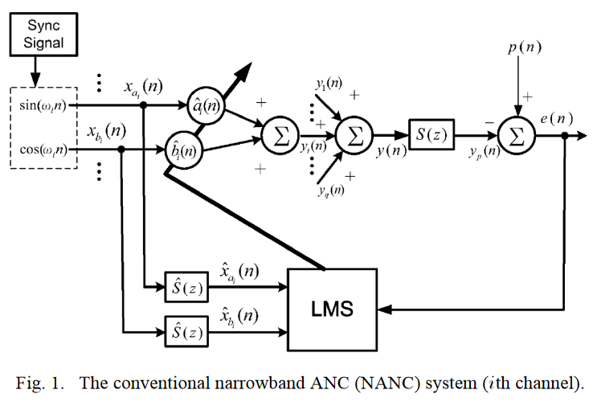

### 1.1 用于NANC的FXLMS算法

在这些 ANC 系统中，滤波 X 最小均方 (FXLMS) 算法 [3] 是最流行的更新控制器的自适应算法，因为它在降噪性能和实施成本方面对现实应用具有良好的适用性。FXLMS算法采用固定步长，使得ANC系统在平稳噪声环境下具有合理的收敛速度，并对非平稳噪声信号表现出较好的跟踪能力。

#### （1）用于WANC的FXLMS算法

$$
\begin{align}
更新步:&\boldsymbol{x}[n] = [x[n],x[n-1],\dots,x[n-L+1]]\\
&\boldsymbol{x}'[n] =\hat{s}[n]*\boldsymbol{x}[n]\\
&d[n]\\
&y[n] = \boldsymbol{w}[n]\boldsymbol{x}[n]^\top\\
&e[n] = d[n]-s[n]*y[n]\\
迭代步:& \boldsymbol{w}[n+1]= \boldsymbol{w}[n]+\mu \boldsymbol{x}'[n]e[n]
\end{align}
$$

#### （2）用于NANC的FXLMS算法

$$
\begin{align}
更新步:
X[n]= &[x_{a_1}[n],x_{b_1}[n],\dots,x_{a_q}[n],x_{b_q}[n]]^\top\\
{X}'[n]=&\hat{s}[n]*{X}[n]\\
d[n]=&d[n]\\
y[n] = &\boldsymbol{w}[n]^\top X[n]=[\hat{a}_1,\hat{b}_1,\dots,\hat{a}_q,\hat{b}_q]{X}[n]\\
e[n] = &d[n]-s[n]*y[n]\\
迭代步: \boldsymbol{w}[n+1]=& \boldsymbol{w}[n]+\mu {X}'[n]e[n]\\
\begin{bmatrix}
	\hat{a}_1[n+1]\\\hat{b}_1[n+1]\\\vdots\\\hat{a}_q[n+1]\\\hat{b}_q[n+1]
\end{bmatrix}=&
\begin{bmatrix}
	\hat{a}_1[n]\\\hat{b}_1[n]\\\vdots\\\hat{a}_q[n]\\\hat{b}_q[n]
\end{bmatrix}+
\begin{bmatrix}
	\mu_{a_1}&&&&\\
	&\mu_{b_1}&&&\\
	&&\ddots&&\\
	&&&\mu_{a_q}&\\
	&&&&\mu_{b_q}
\end{bmatrix}X'[n]e[n]
\end{align}
$$

### 1.2 用于NANC的FXRLS算法

与 FXLMS 算法相比，FXRLS 算法对平稳噪声的收敛速度要快得多。然而，它跟踪非平稳噪声环境的速度非常缓慢，有时甚至表现出比固定步长 FXLMS 算法更差的性能。这是因为随着递归的进行，其增益矩阵逐渐变得饱和和/或变得极小。

解决这一问题的思路是：不时地或者根据噪声环境的非平稳性的检测来更新其增益矩阵，但还需要选择什么时刻更新、如何更新，并且还需要考虑更新所带来的运算开销。

为了使算法无论对于平稳噪声还是非平稳噪声都快速收敛，可尝试在FXLMS算法中使用可变步长。如果设计得当，可变步长 FXLMS (VSS-FXLMS) 算法可能会像 FXRLS 算法一样快速收敛，并且比 FXLMS 和 FXRLS 算法更快地跟踪非平稳噪声环境，但代价是计算成本略有增加。

#### （1）用于WANC的FXRLS算法

$$
\begin{align}
更新步:&\boldsymbol{x}[n] = [x[n],x[n-1],\dots,x[n-L+1]]\\
&\boldsymbol{x}'[n] =\hat{s}[n]*\boldsymbol{x}[n]\\
&d[n]\\
&y[n] = \boldsymbol{w}[n]\boldsymbol{x}[n]^\top\\
&e[n] = d[n]-s[n]*y[n]\\
迭代步:&\boldsymbol{w}[n+1]= \boldsymbol{w}[n]+\cfrac{\boldsymbol{Q}(n-1)\boldsymbol{x}'[n]e[n]}{\lambda+\boldsymbol{x}'[n]^\top\boldsymbol{Q}(n-1)\boldsymbol{x}'[n]}\\
& \boldsymbol{Q}(n)=\lambda^{-1}\left[\boldsymbol{Q}(n-1)-\cfrac{\boldsymbol{Q}(n-1)\boldsymbol{x}'[n]\boldsymbol{x}'[n]^\top\boldsymbol{Q}(n-1)^\top}{\lambda+\boldsymbol{x}'[n]^\top\boldsymbol{Q}(n-1)\boldsymbol{x}'[n]}\right]\\
\end{align}
$$

#### （2）用于NANC的FXRLS算法

$$
\begin{align}
更新步:
X[n]= &[X_1^\top,\dots,X_q^\top]^\top=[x_{a_1}[n],x_{b_1}[n],\dots,x_{a_q}[n],x_{b_q}[n]]^\top\\
{X}'[n]=&\hat{s}[n]*{X}[n]\\
d[n]=&d[n]\\
y[n] = &\boldsymbol{w}[n]^\top X[n]=[\hat{a}_1,\hat{b}_1,\dots,\hat{a}_q,\hat{b}_q]{X}[n]\\
e[n] = &d[n]-s[n]*y[n]\\
迭代步: \boldsymbol{w}_i[n+1]=& \boldsymbol{w}_i[n]+
\cfrac{\boldsymbol{Q}_i(n-1){X}_i'[n]e[n]}{\lambda+{X}_i'[n]^\top\boldsymbol{Q}_i(n-1){X}_i'[n]}\\
 \boldsymbol{Q}_i(n)=&\lambda_i^{-1}\left[\boldsymbol{Q}_i(n-1)-\cfrac{\boldsymbol{Q}_i(n-1){X}_i'[n]{X}_i'[n]^\top\boldsymbol{Q}_i(n-1)^\top}{\lambda_i+{X}_i'[n]^\top\boldsymbol{Q}_i(n-1){X}_i'[n]}\right]\\
\end{align}
$$

### 1.3 文献综述/VSS-FXLMS算法的研究现状（2013）

+ 1980s，研究了**自适应 FIR 系统辨识**中变步长LMS 算法的应用，并且提出了许多新的 LMS 算法（参考文献[21]–[24]）。

+ 1990s，研究了**信号处理问题**，例如<u>自适应直接频率估计[25]、自适应陷波滤波</u>[26]中，变步长LMS算法的应用。
+ 2000s-2010s，许多研究人员在**基于FIR的宽带ANC**领域提出了类似的变步长算法
  + 变步长算法用于在线次级通路建模[13]、[14]；
  + 变步长算法用于在线反馈通路建模 [15]、[16]；
  + 变步长算法用于FIR 控制器 [17]-[20]。
    + [17] 通过采用**根据每个通带中的参考信号水平而变化的步长**来提高 FIR 控制器<u>对非平稳周期性噪声的响应</u>。
    + [18] 在多通道BANC系统中**将可变步长 LMS 算法应用于自适应 FIR 滤波**，以<u>抑制瞬态和非平稳冲激噪声</u>。
    + [19] **基于能量函数的Fuzzy VSS-FXLMS算法**
    + [20] **基于新的次级通路建模技术的 VSS-FXLMS**
+ 研究创新点：使用由残余噪声信号和可变步长组成的代价函数，提出一种新的NANC VSS-FXLMS 算法
  + 对平稳噪声：所提出的算法比传统的FXLMS算法具有更快的收敛速度，并且收敛速度与FXRLS算法非常相似。
  + 对非平稳噪声：性能明显优于 FXLMS 和 FXRLS 算法。
  + 计算成本：该算法的计算成本略高于FXLMS算法，但明显低于FXRLS算法。通过使用常见的可变步长，进一步简化了所提出的算法以减少计算要求。

### 1.4 VSS-FXLMS算法的基本形式

$$
\begin{align}
更新步:
X[n]= &[X_1^\top,\dots,X_q^\top]^\top=[x_{a_1}[n],x_{b_1}[n],\dots,x_{a_q}[n],x_{b_q}[n]]^\top\\
{X}'[n]=&\hat{s}[n]*{X}[n]\\
d[n]=&d[n]\\
y[n] = &\boldsymbol{w}[n]^\top X[n]=[\hat{a}_1,\hat{b}_1,\dots,\hat{a}_q,\hat{b}_q]{X}[n]\\
e[n] = &d[n]-s[n]*y[n]\\
迭代步: U[n]=& \Xi\odot U[n-1]+\Eta\odot X'[n]\odot X'[n-1]e[n]e[n-1]\\
    \begin{bmatrix}
    	\mu_{a_1}[n]\\\mu_{b_1}[n]\\\vdots\\\mu_{a_q}[n]\\\mu_{b_q}[n]\\
    \end{bmatrix} =& 
    \begin{bmatrix}
    	\xi_{a_1}\\\xi_{b_1}\\\vdots\\\xi_{a_q}\\\xi_{b_q}
    \end{bmatrix}\odot
    \begin{bmatrix}
    	\mu_{a_1}[n-1]\\\mu_{b_1}[n-1]\\\vdots\\\mu_{a_q}[n-1]\\\mu_{b_q}[n-1]\\
    \end{bmatrix} + 
    \begin{bmatrix}
    	\eta_{a_1}\\\eta_{b_1}\\\vdots\\\eta_{a_q}\\\eta_{b_q}
    \end{bmatrix}\odot X'[n]\odot X'[n-1]e[n]e[n-1]\\
\boldsymbol{w}_i[n+1]=& \boldsymbol{w}_i[n]+U[n]\odot X'[n]e[n]
\end{align}
$$

### 1.5 简化的VSS-FXLMS算法

#### （1）VSS-FXLMS-I

$$
\begin{align}
    \begin{bmatrix}
    	\mu_{1}[n]\\\mu_{2}[n]\\\vdots\\\mu_{q}[n]\\
    \end{bmatrix} =& 
    \begin{bmatrix}
    	\xi_{1}\\\xi_{2}\\\vdots\\\xi_{q}\\
    \end{bmatrix}\odot
    \begin{bmatrix}
    	\mu_{1}[n-1]\\\mu_{2}[n-1]\\\vdots\\\mu_{q}[n-1]\\
    \end{bmatrix}+
	\begin{bmatrix}
    	\eta_{1}\\\eta_{2}\\\vdots\\\eta_{q}\\
    \end{bmatrix}\odot
	X_a'[n]\odot X_a'[n-1]e[n]e[n-1]\\
	\boldsymbol{w}_i[n+1]=& \boldsymbol{w}_i[n]+U[n]\odot X'[n]e[n]
\end{align}
$$

#### （2）VSS-FXLMS-II

$$
\begin{align}
	\mu[n]=& \xi \mu[n-1] + \eta X[n]\odot X[n-1]e[n]e[n-1]\\
\boldsymbol{w}_i[n+1]=& \boldsymbol{w}_i[n]+\mu[n] X'[n]e[n]
\end{align}
$$

## 二、仿真实验设计

### 2.1 仿真实验一

#### （1）次级通路$S(z)$设计

`fir1`低通滤波器，截止数字频率`Wc = 0.4*pi`，滤波器阶次`M-1=64`

#### （2）次级通路$\hat{S}(z)$辨识：

+ 输入/激励信号：零均值、单位方差白噪声
+ 加性噪声：零均值、方差0.1白噪声
+ 滤波器选用：LMS算法，阶次`M1 - 1 = 68`，步长`mu1 = 0.0025`

#### （3）主噪声$d[n]$设计（论文中记作$p[n]$）

+ 正弦噪声，迭代次数`Nstr = 16000`，分成两段，第二段的系数傅里叶系数取反
  $$
  d[n] = \sum_{i=1}^q [a_i\cos(\omega_i n)+b_i\sin(\omega_i n)] + v_p[n]
  $$
  
+ 第一段：`Nstr = 1:8000; `

  +  `w1 = 0.1*pi; a1 = 2; b1 = -1; `
  +  `w2 = 0.2*pi; a2 = 1; b2 = -0.5; `
  +  `w3 = 0.3*pi; a3 = 0.5; b3 = 0.1; `

#### （4）参考信号$x[n]$设计

$$
\begin{align}
 & x_{a_i}[n]=\sin(\omega_i n)\quad x_{b_i}[n]=\cos(\omega_i n)\\
filtered-x: &\hat{\boldsymbol{x}}_{a_i}[n]=\hat{S}(z)\boldsymbol{x}_{a_i}[n]\quad \hat{\boldsymbol{x}}_{b_i}[n]=\hat{S}(z)\boldsymbol{x}_{b_i}[n]
\end{align}
$$

#### （5）计算

$$
\begin{align}
卷积的实现:{X}'[n]=&\hat{s}[n]*{X}[n]\\
=&[X[n],X[n-1],\dots,X[n-L+1]]\begin{bmatrix}\hat{s}_1\\\hat{s}_2\\\vdots\\\hat{s}_L\end{bmatrix}\\
{y}'[n]=&{s}[n]*{y}[n]\\
=&[y[n],y[n-1],\dots,y[n-L+1]]\begin{bmatrix}{s}_1\\{s}_2\\\vdots\\{s}_L\end{bmatrix}\\
\end{align}
$$

### 2.2 仿真实验二

真实的次级通路是一个IIR系统，其分子与分母阶数均为24，且认为辨识的次级通路与真实路径相同。目前此部分仿真实验的复现仍然存在问题。

#### （1）用于WANC的FULMS

$$
\begin{align}
更新步:&\boldsymbol{x}[n] = [x[n],x[n-1],\dots,x[n-L+1]]^\top\\
&\boldsymbol{y}[n-1] = [y[n-1],y[n-2],\dots,y[n-M]]^\top\\
&\boldsymbol{u}[n] = [\boldsymbol{x}[n]^\top,\boldsymbol{y}[n-1]^\top]^\top\\
&\boldsymbol{u}'[n] =\hat{s}[n]*\boldsymbol{u}[n]\\
&d[n]\\
&y[n] = \boldsymbol{w}[n]^\top\boldsymbol{u}[n]\\
&e[n] = d[n]-s[n]*y[n]\\
迭代步:&\boldsymbol{w}[n+1]= \boldsymbol{w}[n]+\mu\boldsymbol{u}'[n]e[n]\\
\end{align}
$$

#### （2）用于NANC的FULMS

$$
\begin{align}
  更新步:
    X[n]= &[x_{a_1}[n],x_{b_1}[n],\dots,x_{a_q}[n],x_{b_q}[n]]^\top\\
    {X}'[n]=&\hat{s}[n]*{X}[n]\\
    d[n]=&d[n]\\
    y[n] = &\boldsymbol{w}[n]^\top X[n]=[\hat{a}_1,\hat{b}_1,\dots,\hat{a}_q,\hat{b}_q]{X}[n]\\
    e[n] = &d[n]-s[n]*y[n]\\
    迭代步: \boldsymbol{w}[n+1]=& \boldsymbol{w}[n]+\mu {X}'[n]e[n]\\
    \begin{bmatrix}
        \hat{a}_1[n+1]\\\hat{b}_1[n+1]\\\vdots\\\hat{a}_q[n+1]\\\hat{b}_q[n+1]
    \end{bmatrix}=&
    \begin{bmatrix}
        \hat{a}_1[n]\\\hat{b}_1[n]\\\vdots\\\hat{a}_q[n]\\\hat{b}_q[n]
    \end{bmatrix}+
    \begin{bmatrix}
        \mu_{a_1}&&&&\\
        &\mu_{b_1}&&&\\
        &&\ddots&&\\
        &&&\mu_{a_q}&\\
        &&&&\mu_{b_q}
    \end{bmatrix}X'[n]e[n]
\end{align}
$$

$$
\begin{align}

    X'[n]=&\hat{s}[n]*x[n]\\
		=&\hat{D}[n]^\top \boldsymbol{X}[n]+\hat{N}[n]^\top \boldsymbol{X}'[n-1]\\
	y'[n]=&{s}[n]*y[n]\\
		=&{D}[n]^\top \boldsymbol{y}[n]+{N}[n]^\top \boldsymbol{y}'[n-1]
\end{align}
$$

### 2.3 仿真实验三、四

原论文使用采集的旋转机械噪声验证效果，此处仿真实验暂且从略

## 三、仿真实验结果

### （1）实噪声抑制情况

    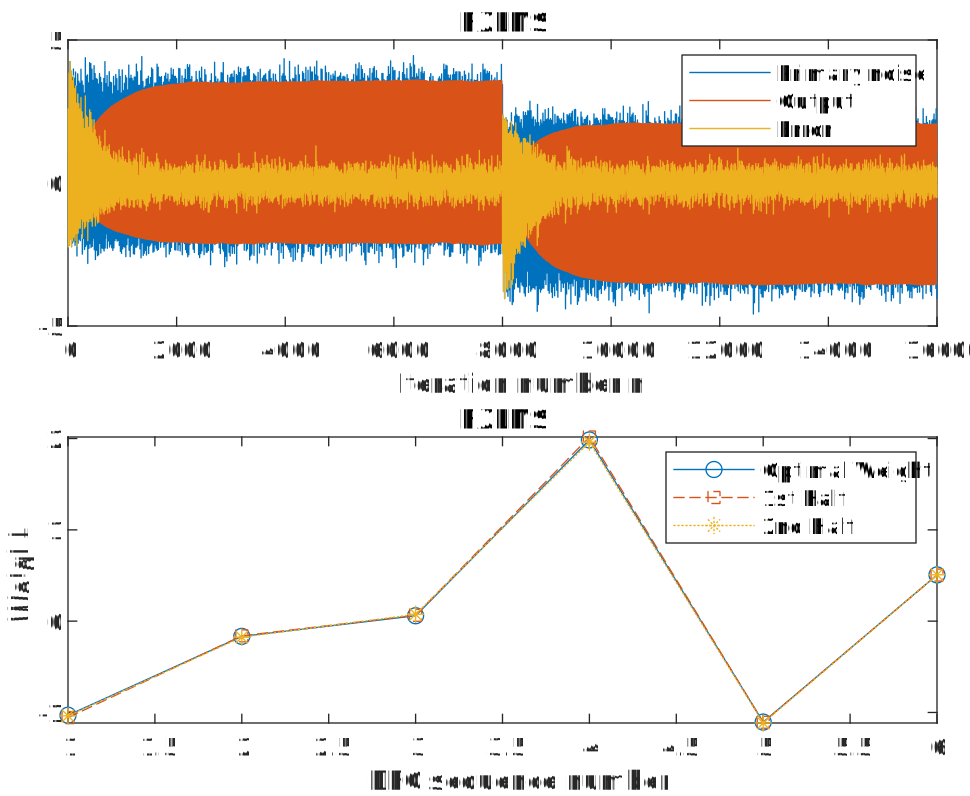
    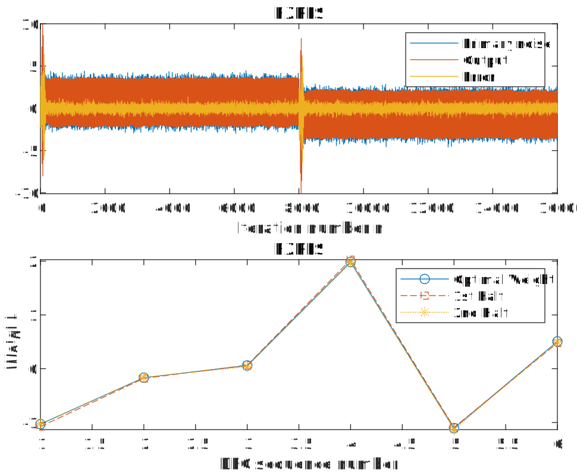
    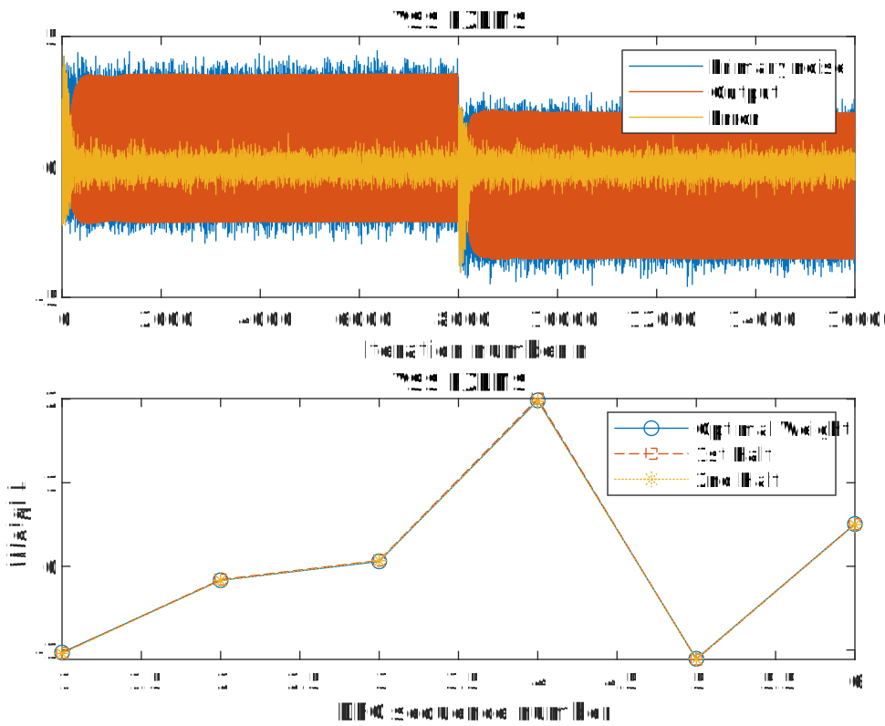

### （2）权重参数MSE收敛情况

    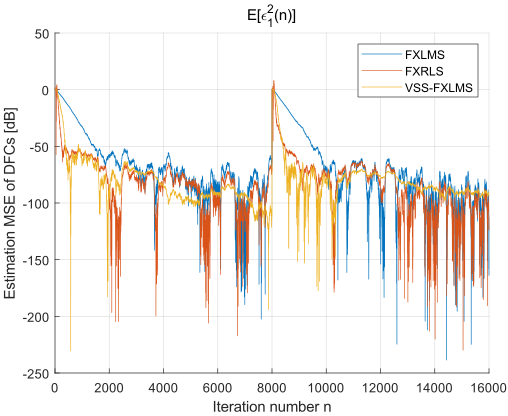
    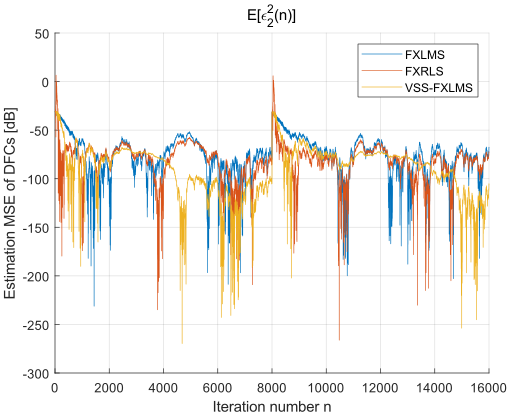
    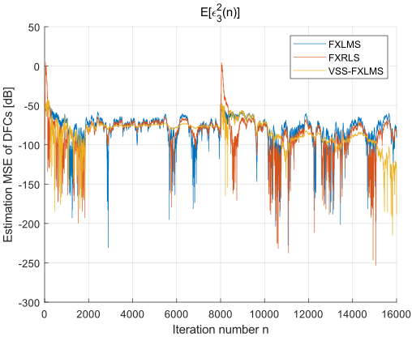

### （3）误差MSE收敛情况

    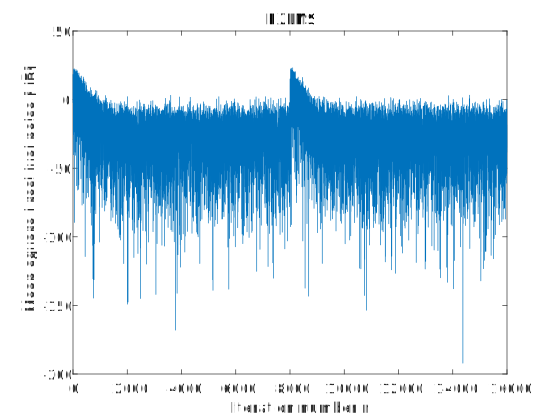
    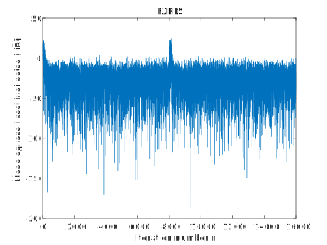
    

### (4) 可变步长收敛情况

    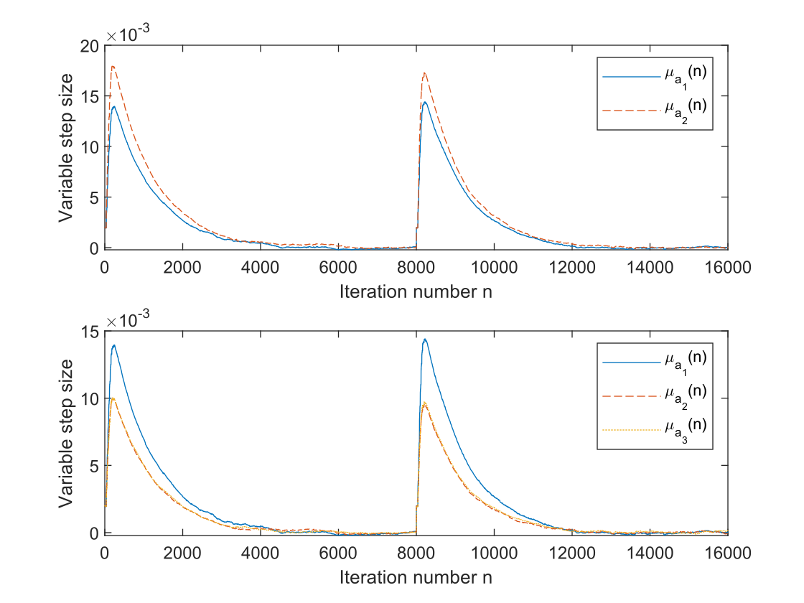

### (5) VSS-FXLMS及其简化算法的权重参数收敛情况

    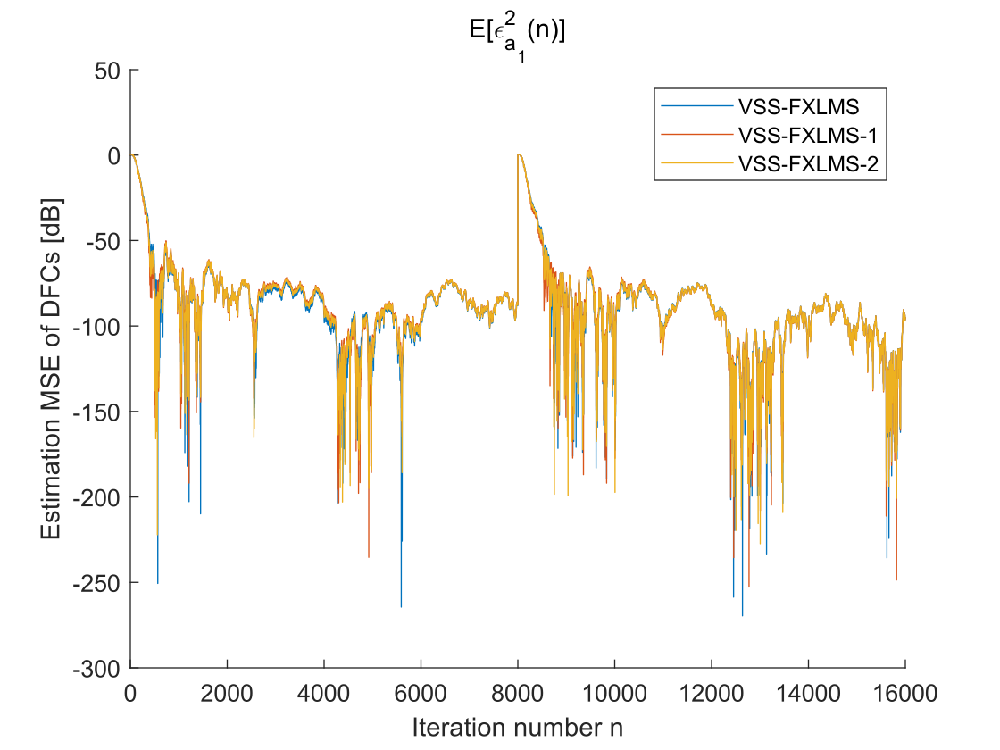
    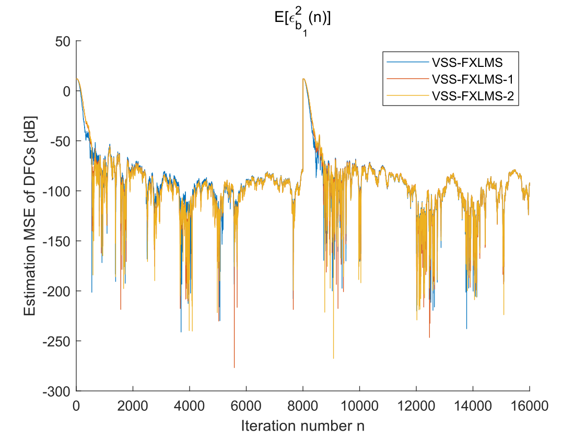

## 四、实验结论

+ **R1** 总体上，VSS-FXLMS系统比传统系统运行得更好。可见权重参数MSE与误差MSE收敛情况。

  + 对于相同的稳态 MSE，新算法的收敛速度比传统的 FXLMS 算法快得多；
  + 对于平稳噪声环境：VSS-FXLMS算法与 FXRLS 算法相似的收敛性；
  + 对于非平稳主噪声：FXRLS 算法失去跟踪主正弦成分 DFC 突然变化的能力，而 VSS-FXLMS 算法则可以很好地跟踪这些变化，其性能优于 FXLMS 和 FXRLS 算法。
  + 权重参数MSE的收敛问题中，因为它的稳态 DFC 估计均方根误差要求与其他算法大致相等，FXLMS算法的收敛速度非常慢。若要使收敛速度更快，其稳态性能会显著下降。这与LMS算法自适应 FIR 滤波的结论一致。

+ **R2** 可变步长收敛情况图像

  + 采用相同的用户参数 $\xi_i$、$\xi$ 、$\eta_i$ 、$\eta$，步长$\mu_{a_1},\mu_{b_1}$的曲线在形状上非常相似。
  + 对于不同的用户参数，步长$\mu_{a_1},\mu_{a_2},\mu_{a_3}$所描绘的曲线形状相似，但幅度不同。

+ **R3** VSS-FXLMS算法可选参数$\xi_i,\xi$的可选范围相当窄
  + 仿真表明，0.999 左右的值似乎是一个不错的选择，其他值可能会使算法工作不佳甚至发散。
  + 需要进行分析工作来为参数确定可行的范围和界。

+ **R4** 简化的 VSS-FXLMS 算法的执行效率比原始形式稍差一点

  但仍然比 FXLMS 和 FXRLS 算法好得多，更重要的是计算复杂度低一些。
